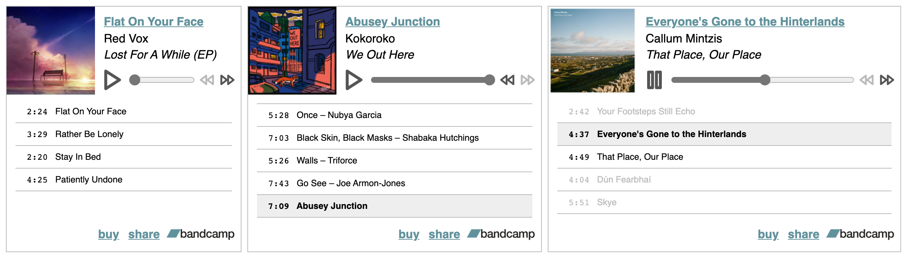
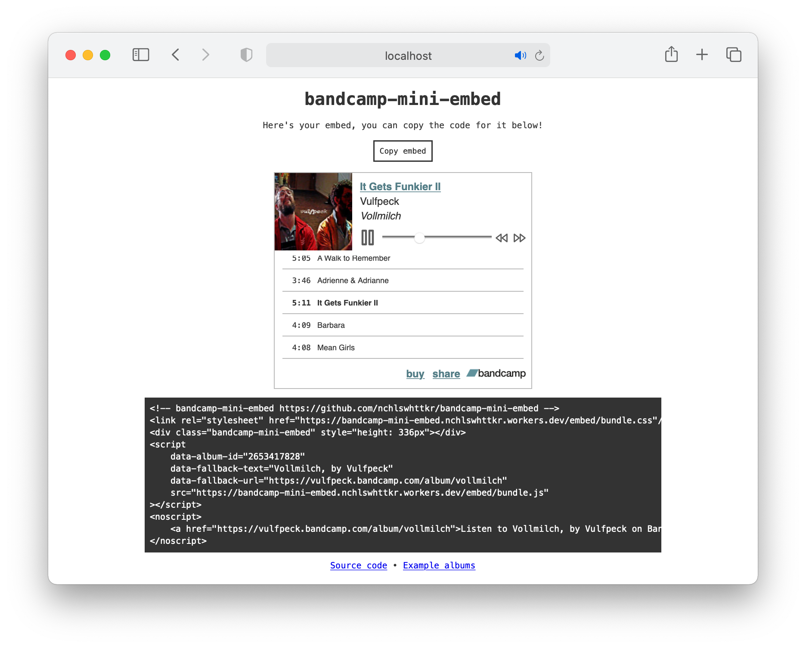

# bandcamp-mini-embed

A music player embed for Bandcamp albums

- Can display compilation albums and albums with limited preview tracks
- Embed multiple albums in a single page without conflicts
- Lazy-loaded player, and no tracks are downloaded until you hit "Play"
- Dark mode friendly, keyboard friendly, and compatible with system media controls

Does this count as a microfrontend?



Bandcamp logo is property of [Bandcamp](https://bandcamp.com). Icons belong to [Feather](https://feathericons.com/).

## Usage

[](https://deploy.workers.cloudflare.com/?url=https://github.com/nchlswhttkr/bandcamp-mini-embed)

To set up your own deployment, you follow the steps below or use button above.

1. [Fork this repository](https://github.com/nchlswhttkr/bandcamp-mini-embed/fork)
1. Enable GitHub Actions in your fork from the **Actions** tab
1. Add your `CF_ACCOUNT_ID` and `CF_API_TOKEN` repository secrets in the **Secrets** section of the **Settings** tab
   - Your Cloudflare account ID can be copied from [the dashboard](https://dash.cloudflare.com/?to=/:account/workers/overview)
   - You'll need to [create an API token](https://dash.cloudflare.com/profile/api-tokens) with the `Workers Script:Edit` permission
1. From the **Actions** tab, select the **Build and deploy to Cloudflare** workflow and trigger a run on the `main` branch with the **Run workflow** button.

From here you can open your deployment, and enter the URL of the Bandcamp album you'd like to embed into the form.

After you hit **Generate embed**, you'll see a preview of the embed as well the code snippet powering it. You can use this code wherever you'd like to embed the album.



## Development

To get started, clone this project and install dependencies. After that you can run the local development server.

```sh
git clone https://github.com/nchlswhttkr/bandcamp-mini-embed.git
cd bandcamp-mini-embed
nvm use
npm ci
npm run dev
```

Changes you make to the embed and the worker itself will trigger a rebuild of the worker, but you'll need to reload the page to access them.

<!--
TODO
 - https://botany.bandcamp.com/track/fourteen-45-tails
 - Support tracks rather than only albums
 - Document that player doesn't seem to play nice with constructor API
 - Check compatability with audio/source elements, fix console errors
 - Look for guidance on range input accessibility
 - Error handling if no tracks are streamable
 - Remove/resolve workaround with inconsistent seeking on Firefox
 - Fix album artwork appearing distorted on Safari (specify img width)
 -->
