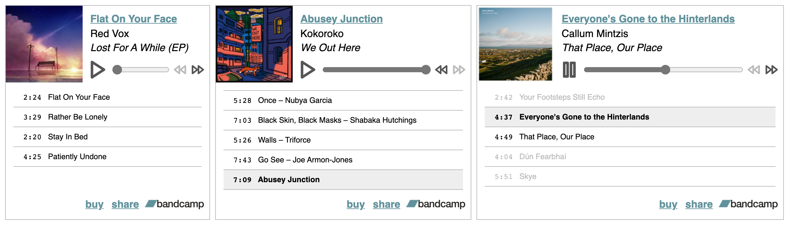

# bandcamp-mini-embed

A small Svelte client for embedding albums from Bandcamp into your site.

- Handles compilation albums and albums with limited preview tracks
- Embed multiple albums in a single page without conflicts
- Embedded albums only load when scrolled into view

Does this count as a microfrontend?



Bandcamp logo is property of [Bandcamp](https://bandcamp.com). Icons belong to [Feather](https://feathericons.com/).

## Development

If you'd like to try this out, you can clone this project and run it locally. You'll need the [Vercel CLI](https://vercel.com/docs/cli) installed.

```sh
npm ci
(cd api && npm ci)
vercel dev
```

## Usage

Clone, build, and deploy the artifacts and serverless functions to Vercel.

```
git clone https://github.com/nchlswhttkr/bandcamp-mini-embed.git
cd bandcamp-mini-embed
npm ci
(cd api && npm ci)
npm run build
vercel
```

Open your deployment, and enter the name of the album you'd like to embed into the form.

After you hit **Generate embed**, you'll see a preview of the embed as well the code snippet powering it. You can use this code wherever you'd like to embed your album.

<!--
TODO
 - https://botany.bandcamp.com/track/fourteen-45-tails
 - Support tracks rather than only albums
 - Handling play suspending (waiting)
 - Document that player doesn't seem to play nice with constructor API
 - Check compatability with audio/source elements, fix console errors
 - Look for guidance on range input accessibility
 - Investigate dynamically generating/linking caption files
 - Error handling if no tracks are streamable
 - Remove/resolve workaround with inconsistent seeking on Firefox
 - Fix keyboard navigation, disabled elements
 - Fix album artwork appearing distorted on Safari (specify img width)
 - Make player icons look nicer in dark mode
 -->
