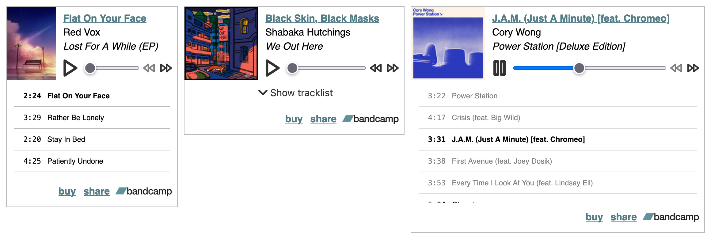
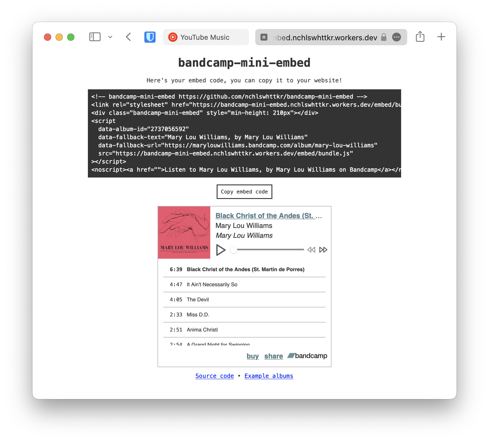

# bandcamp-mini-embed [](https://buildkite.com/nchlswhttkr/bandcamp-mini-embed)

A music player embed for Bandcamp albums. Does this count as a microfrontend?

- Displays albums, singles, compilations, preview tracks
- Lazy-loaded player, no tracks are downloaded until you hit "Play"
- Dark mode friendly, keyboard friendly, and compatible with system media controls



Bandcamp logo is property of [Bandcamp](https://bandcamp.com). Icons belong to [Feather](https://feathericons.com/).

## Usage

To set up your own deployment, clone this repository and deploy your own copy of the worker.

```sh
nvm install
npm ci
npm run deploy
```



## Development

To get started, clone this project and install dependencies. After that you can run the local development server.

```sh
nvm use
npm ci
npm run dev
```

Changes you make to the embed and the worker itself will trigger a rebuild of the worker, but you'll need to reload the page to access them.
